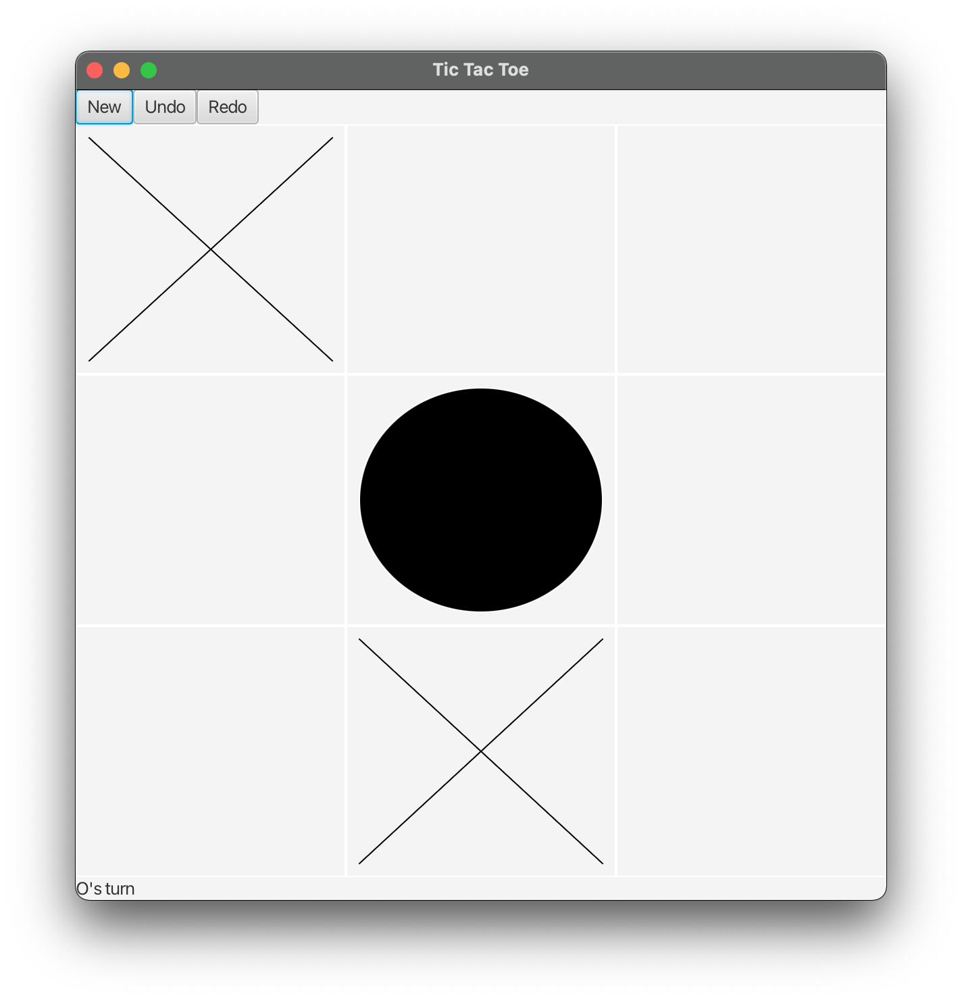
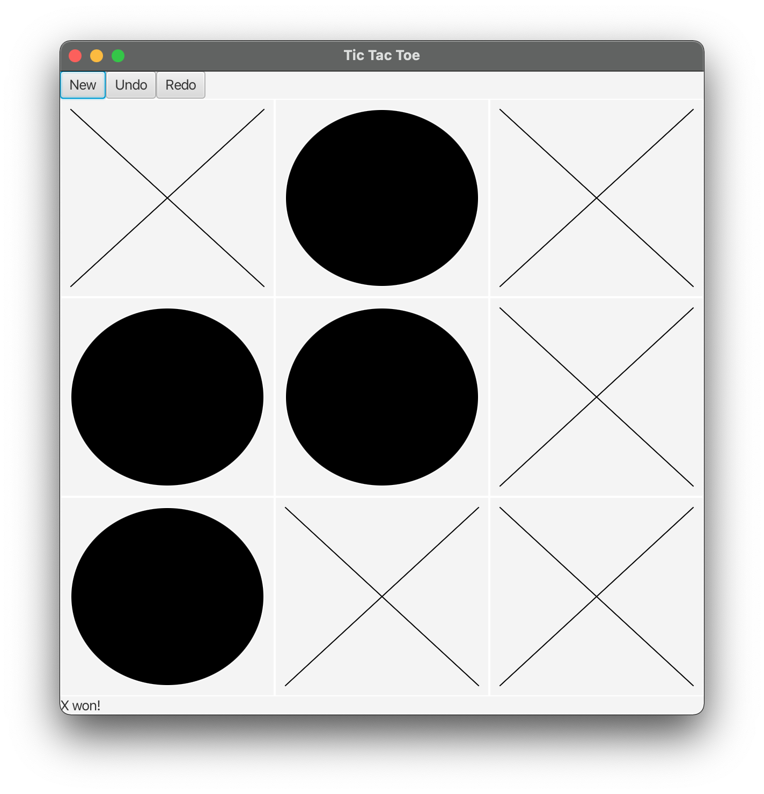
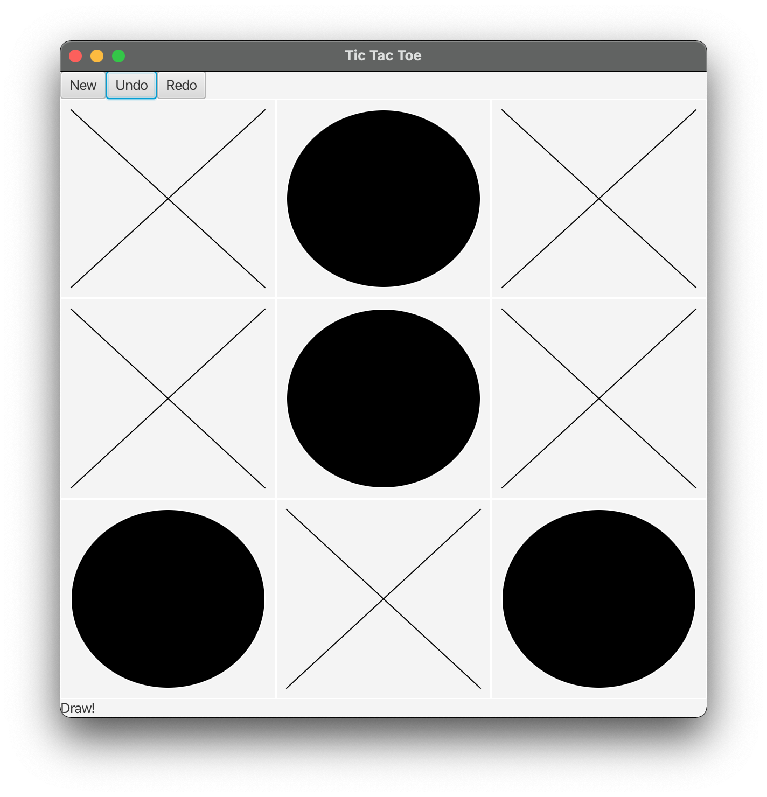
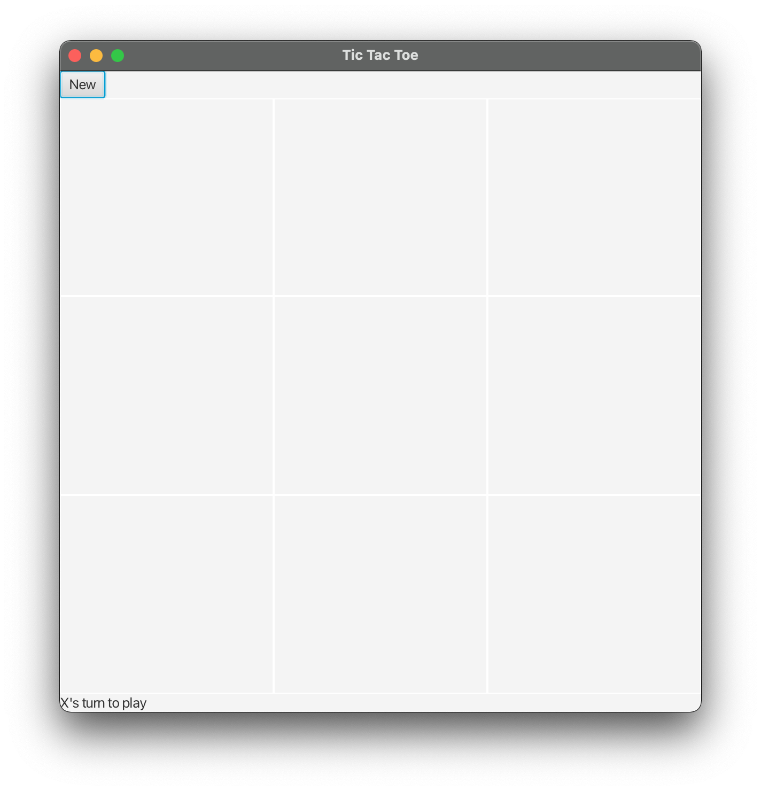
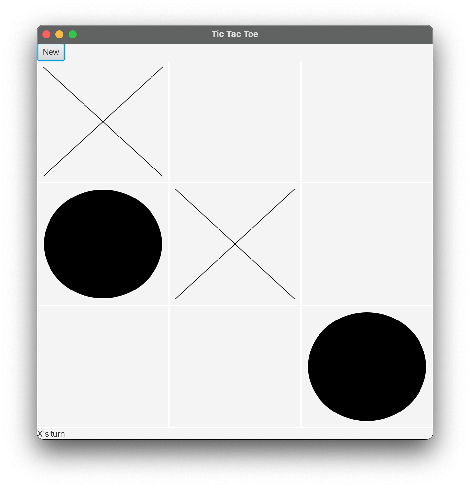
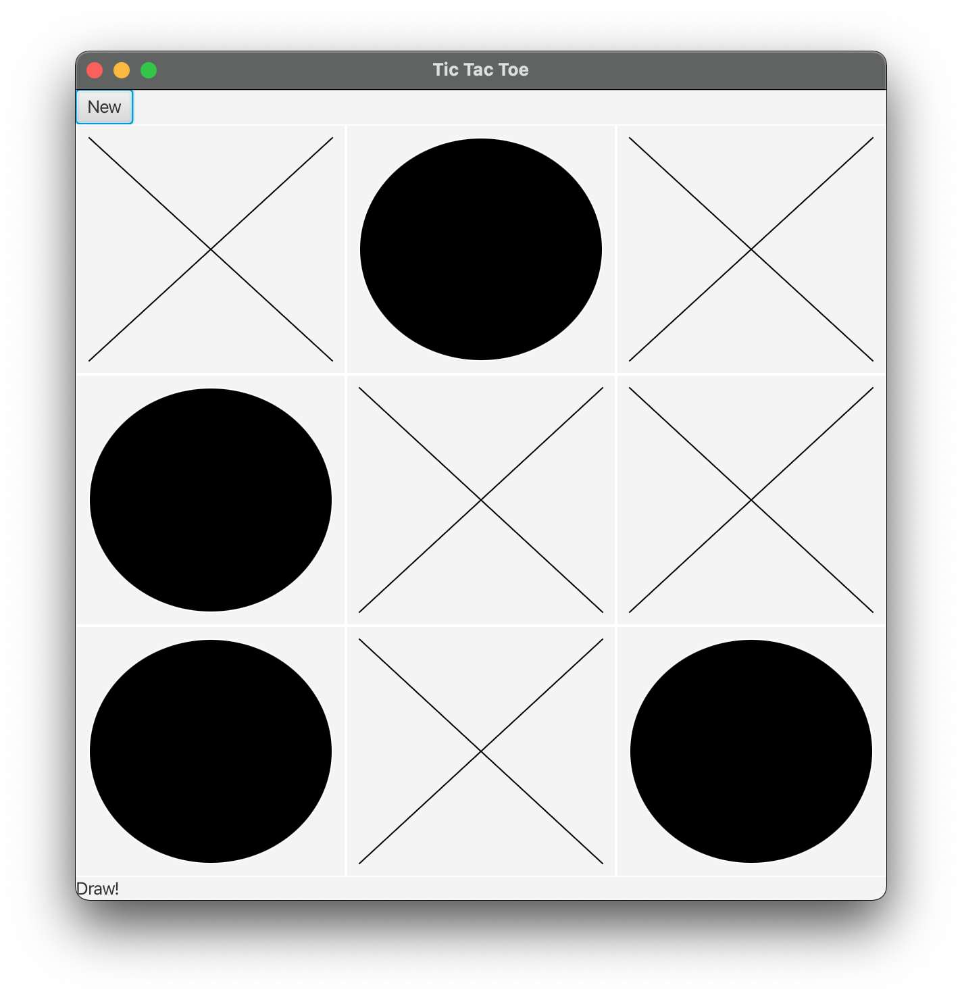
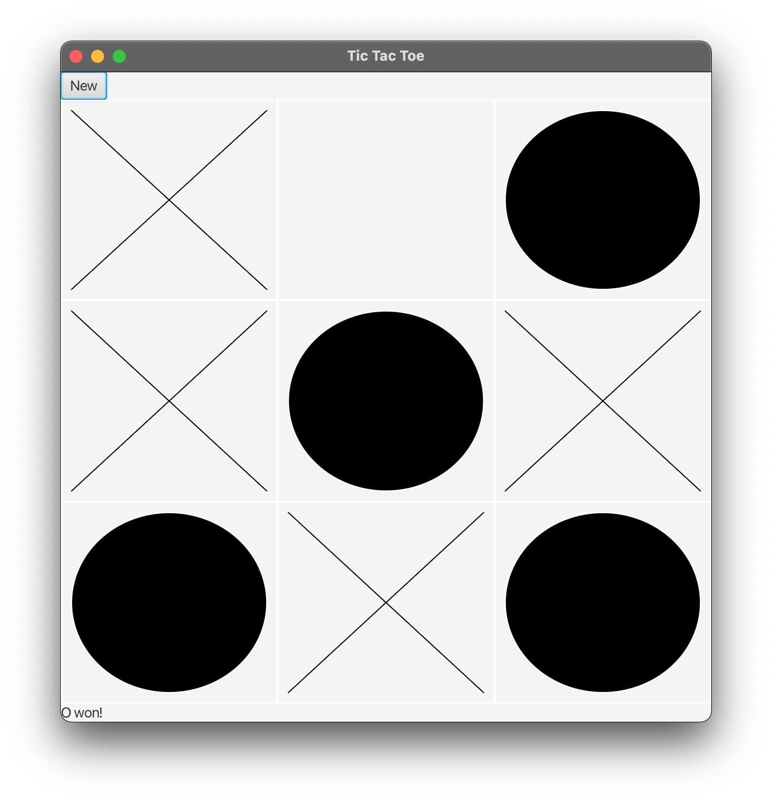
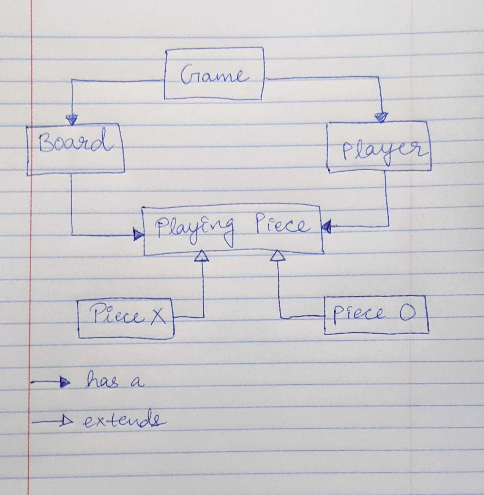
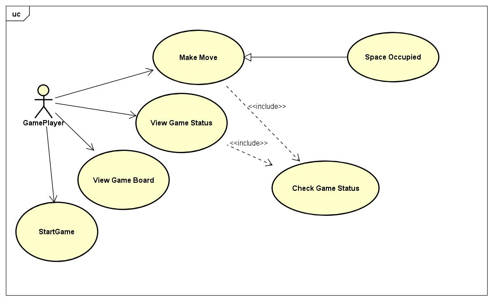
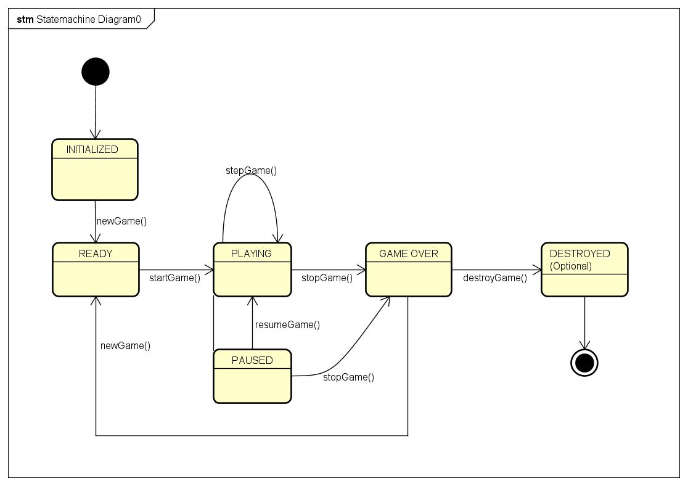

# Team 12 Project 

## Game Tic Tac Toe

This is my project to implement a Tic Tac toe game you may had seen somewhere, but with advance feature thats called Undo and redo, and implemented full gaming using below some design patterns.

## Project Goals

1 learnt about the JavaFX sdk we used in the project to create the User Interface for the Tic Tac Toe game.
He worked on the requirement analysis and contributes to the design of the game. He worked on starter code for the project, ie initial code given in the project and extends Decorator pattern for implementing two Game modes in our project.
He worked on chain of responsibility pattern for the functionality similar to above one, checks whether its a draw in the game or X or O won the game.
After testing and finding that O won the game, Message provided in the UI.
Creates the Class Diagram for the project. He also maintained the Team Journal.

The patterns implemented in the following project

1. Singleton

2. State

3. Memento

a. Singleton: Make the class singleton by having a private constructor and initialising it once.

2. State - Create multiple states based on the app behaviour

a. WinState

b. DrawState

c. ContinueState

Check if the move is win or lose. Perform this move in the state and run the action. Have a StateManager to manage the states.

3. Memento – You save the states of an object and use it for undo/redo. It should support undo and redo operation using the system state.The main feature is to save that state of the object for undo/redo feature and restore the state of the object from the array based on undo/redo.

**Classes**
1. Singleton - SimplePage
2. State : StateMachine
           -> WonState
           -> DrawState
           -> NextState
3. Memento class - Memento class
                   a. Originator class
                   b. Caretaker class

* have implemented 3 buttons for this game.
    1. New Game button
    2. Undo Button
    3. Redo Button
    
This Command Pattern kicks in to run the appropreate logic when the player clicks one of the above buttons to do the action.

* The making of the ad video was interesting considering that I had created some good animated effects and transitions.

* Understood the project requirements

* Explored GreenFoot and Java FX

* Drawn and Explained the game Architecture

* Implement TicTacToe logic

## Game screenshots

### Advance Mode - 

### Standard Mode -

## Architecture Diagram -

### Explanation:

* Playing Piece has a piece type that is dynamically defined, based on help from its children – PieceX and PieceO

* PieceX passes type X to the parent Playing Piece

* While PieceO passes type X to the parent Playing Piece

Board - 2 D matrix of size of(nxn) and having Playing Piece as store.

* Player: There are two players - PlayerX and PlayerO

* Game is a main component which has a Board and a Player

## UML Diagrams
### UseCase Diagram

### State Diagram

### Class Diagram

### Sequence Diagram

## Design Patterns used in the project

### Strategy Pattern

A behavioural design pattern called strategy lets you build a family of algorithms, encapsulate each one into a separate class, and make their objects interchangeable.

### Decorator

Decorator is used to add further responsibilities to an object dynamically. In this project, we used Decorator for displaying two type interface of game-modes, such as Standard-mode and Advance-mode.

In standard mode players are able to play a normal noughts and crosses game with only one feature, to restart the game .

In Advance Mode you can undo/redo your moves as on standard mode.

### Chain of responsibility

Chain of responsibilty specifies responsibility delegation by sending more than one object a chance to handle a request. Instead of sending the request directly to its receiver, chain of responsibilty creates a receiving chain of objects, and sends the request among the objects until an object can handle it.

In this project using this flow for Checking the game over , match three X's or O in any row if it finds match return Win for X or O otherwise it passes to check column only if no match in row if it finds match at column return Win for X or O otherwise it passes to diagonals Checking only anti and diagonals if it finds match return Win for X or pass if not returns Game not over according to user input

### Command Pattern

It is not uncommon for turn-based games to have an ‘undo’ button but for situations where you might be making many requests of the user per game turn, it’s far easier to let them make mistakes, and undo what they’ve just done, than it is to have the system to ask “are you really sure you want to do this task?” for every action the user takes. Similar considerations are important in mobile game development, especially for such touch-native devices that ironically often have quite clumsy touch recognition.

So implemented 3 buttons for this game.

1. New Game button

2. Undo Button

3. Redo Button

This Command Pattern is used to execute the correct logic when you clicked the Player above button for any one of the above actions.

### Memento

Memento is a design pattern that allows to capture and externalize internal state of an object so that object can be roll backed to this state later on. In this particular project I have used Memento design pattern in conjucntion with Command design pattern in Tic-Tac-Toe undo-redo.

I can undo and redo many times without the object’s state getting lost. Everytime we make a move, we are storing the object’s state. On each undo, we can go back to the previous state, since we store the previous state details.

### State Pattern

State lets an object react differently when its internal state changes. It will seem to change its class.

The Tic-Tac-Toe game can have 3 states based on each move.

1. Draw

2. Win

3. Next Move - Continue

The states keep working as long as the game is running. We read the state, and we update the state of the machine by checking out the status of the game every move.

## Singleton

Ensure there is only one instance of a class, and provide a central global point to access it.

singleton has a private constructor because we do not want the object to be created twice. The global access of the object is done using a static method. It first checks whether the object creation has been done or not. It returns the current state of the object based on that.

# Project-TicTacToe
